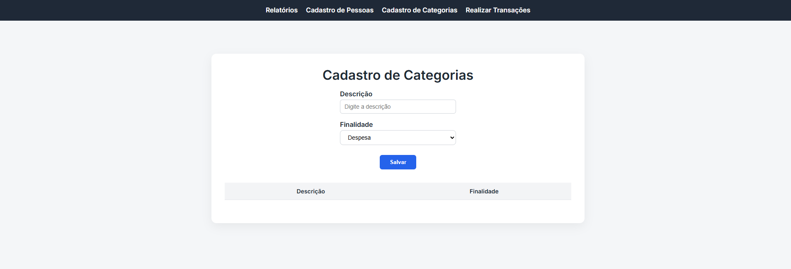
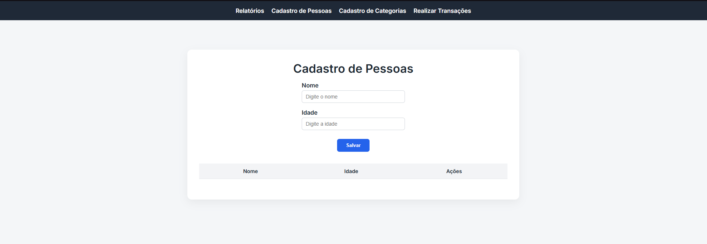
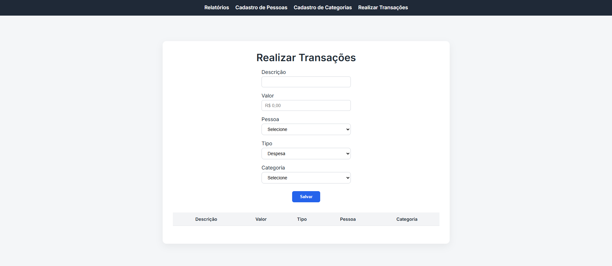
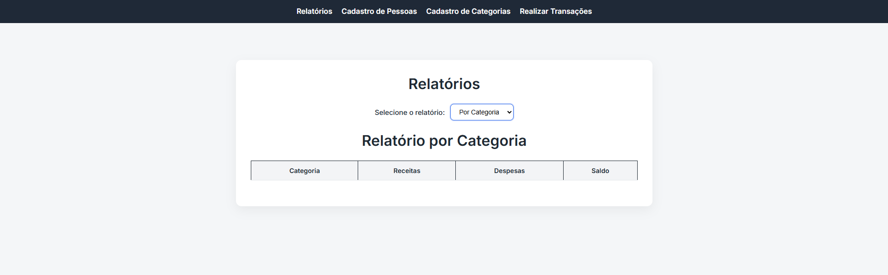

# 📋 Gestor de Gastos Residenciais

Sistema de controle de gastos residenciais com operações **CRUD** e visualização de relatórios a partir de filtros, desenvolvido com uma arquitetura moderna separando frontend e backend.

## 🚀 Tecnologias Utilizadas

### Frontend
- **React** — Biblioteca para construção da interface de usuário
- **TypeScript (TS)** — Linguagem principal do frontend
- **JavaScript (JS)** — Linguagem secundária do frontend

### Backend
- **C#** — Linguagem principal da API
- **.NET** — Ecossistema utilizado na API
- **ASP.NET Core** — Framework utilizado na API
- **Dapper** — ORM utilzado para manipulaçãoo de dados da API

## ✨ Funcionalidades

- **Visualização de relatórios** a partir de um filtro, onde o relatório pode ser por categoria ou por pessoa, possuindo também uma exibição do total geral (Receitas, Despesas e Saldo)
- **Criar** cadastros de pessoas e cadastro de categorias a partir de uma finalidade (Despesa, Receita ou Ambas)
- **Realizar Transações** descrevendo a transação, selecionando uma pessoa previamente cadastrada (Pessoas menores de 18 anos só podem realizar transações do tipo Despesa), atribuindo o valor da transação, tipo (Despesa ou Receita) e uma categoria previamente cadastrada

## 📸 Screenshots

<h3>Cadastro de Categorias</h3>

<h3>Cadastro de Pessoas</h3>

<h3>Realizar Transações</h3>

<h3>Relatórios</h3>

